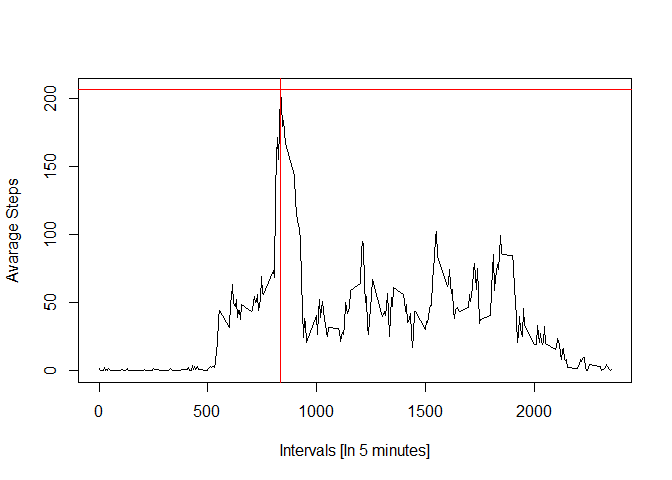

## Loading and preprocessing the data


```r
fileURL <- "https://d396qusza40orc.cloudfront.net/repdata%2Fdata%2Factivity.zip"
fileLocal <- "activity.zip"
fileLocalExt <- "activity.csv"

if(!file.exists(fileLocal)){
  download.file(fileURL, fileLocal)
}

activityData <- read.csv(unz(
  fileLocal,
  fileLocalExt
  ),
  header = TRUE)
```

Before we proceed, its good to have a look at data. 


```r
dim(activityData)
```

```
## [1] 17568     3
```

```r
str(activityData)
```

```
## 'data.frame':	17568 obs. of  3 variables:
##  $ steps   : int  NA NA NA NA NA NA NA NA NA NA ...
##  $ date    : Factor w/ 61 levels "2012-10-01","2012-10-02",..: 1 1 1 1 1 1 1 1 1 1 ...
##  $ interval: int  0 5 10 15 20 25 30 35 40 45 ...
```

```r
head(activityData)
```

```
##   steps       date interval
## 1    NA 2012-10-01        0
## 2    NA 2012-10-01        5
## 3    NA 2012-10-01       10
## 4    NA 2012-10-01       15
## 5    NA 2012-10-01       20
## 6    NA 2012-10-01       25
```

```r
summary(activityData)
```

```
##      steps                date          interval     
##  Min.   :  0.00   2012-10-01:  288   Min.   :   0.0  
##  1st Qu.:  0.00   2012-10-02:  288   1st Qu.: 588.8  
##  Median :  0.00   2012-10-03:  288   Median :1177.5  
##  Mean   : 37.38   2012-10-04:  288   Mean   :1177.5  
##  3rd Qu.: 12.00   2012-10-05:  288   3rd Qu.:1766.2  
##  Max.   :806.00   2012-10-06:  288   Max.   :2355.0  
##  NA's   :2304     (Other)   :15840
```
## What is mean total number of steps taken per day?


```r
# Enable packages
library(lubridate)
library(dplyr)
```


```r
date_wise_steps <- select(activityData, steps, date, interval) %>%
  group_by(date) %>%
  summarise(total_steps = sum(steps, na.rm = TRUE))


hist(date_wise_steps$total_steps, 
     breaks = 50,
     xlab = "Total steps taken each day",
     ylab = "Frequency [Number of days]",
     main = "Histogram of total steps per day")
meansteps <- round(mean(date_wise_steps$total_steps),0)
mediansteps <- median(date_wise_steps$total_steps)

abline(v = meansteps, col = "blue", lwd = 2, lty = 4)
abline(v = mediansteps, col = "pink", lwd = 2, lty = 4)
```

<!-- -->

Mean of total steps per days is : **9354**  
Median of total steps per days is : **10395**

## What is the average daily activity pattern?


```r
interval_wise_steps <- select(activityData, steps, date, interval) %>%
  group_by(interval) %>%
  summarise(average_steps = mean(steps, na.rm = TRUE))

plot(interval_wise_steps$interval, 
     interval_wise_steps$average_steps, 
     type = "l",
     xlab = "Intervals [In 5 minutes]",
     ylab = "Avarage Steps")

max_steps <- max(interval_wise_steps$average_steps)
top_interval <- interval_wise_steps[
  interval_wise_steps$average_steps == max_steps,
  ]$interval

abline(h = max_steps, col = "red")
abline(v = top_interval, col = "red")
```

<!-- -->

**206** steps are the maximum numbers of steps taken in **835** ^th^ interval of 5 minutes intervals.

## Imputing missing values


```r
# step 1 count number of missing data records
na_count <- count(activityData[is.na(activityData$steps),])
```

Total **2304** number of records out of **17568** have missing values. I have decided to replace NA with mean value of given 5 minute interval. 


```r
# step 2 and 3 replace NA with mean steps value for given 5 minute interval and create new dataset
#cat(str(activityData))
UpdatedActivityData <- select(activityData, steps, date, interval) %>%
  left_join(interval_wise_steps, ., by = c("interval")) %>%
  mutate(steps = if_else(is.na(steps), average_steps, as.double(steps))) %>%
  select(steps, date, interval) %>%
  distinct %>%
  arrange(date, interval)
#cat(str(activityData))

# step 4 create histogram

date_wise_steps <- select(UpdatedActivityData, steps, date, interval) %>%
  group_by(date) %>%
  summarise(total_steps = sum(steps, na.rm = TRUE))

hist(date_wise_steps$total_steps, 
     breaks = 50,
     xlab = "Total steps taken each day",
     ylab = "Frequency [Number of days]",
     main = "Histogram of total steps per day")
meansteps <- mean(date_wise_steps$total_steps)
mediansteps <- median(date_wise_steps$total_steps)

abline(v = as.integer(meansteps), col = "blue", lwd = 2, lty = 4)
abline(v = as.integer(mediansteps), col = "pink", lwd = 2, lty = 4)
```

<!-- -->

Mean of total steps per days is : **10766**  
Median of total steps per days is : **10766**  

After imputing NA's from data 2 major observations are:  
1. Number of total steps for 0 step redused drastically.  
2. Means and Median for total number of steps came closer (ovelapped).  


## Are there differences in activity patterns between weekdays and weekends?


```r
UpdatedActivityData$day <- ifelse(
  wday(UpdatedActivityData$date, label = TRUE) %in% c("Sun","Sat"),"weekend","weekday"
  )

head(as.data.frame(UpdatedActivityData))
```

```
##       steps       date interval     day
## 1 1.7169811 2012-10-01        0 weekday
## 2 0.3396226 2012-10-01        5 weekday
## 3 0.1320755 2012-10-01       10 weekday
## 4 0.1509434 2012-10-01       15 weekday
## 5 0.0754717 2012-10-01       20 weekday
## 6 2.0943396 2012-10-01       25 weekday
```

```r
#par("mfrow" = c(2,1))
library(lattice) 

interval_wise_steps <- select(UpdatedActivityData, steps, date, interval, day) %>%
  group_by(interval, day) %>%
  summarise(average_steps = mean(steps, na.rm = TRUE))

#head(interval_wise_steps)

xyplot(average_steps ~ interval | day, data = interval_wise_steps, 
       type = "l",
       ylab = "Avarage number of steps",
       layout = c(1,2))
```

<!-- -->

There is difference in patterns in Weekday and Weekend. Compaired to weekends, weekdays have steep peak in early hours. 


```r
rm(list = ls())
```

